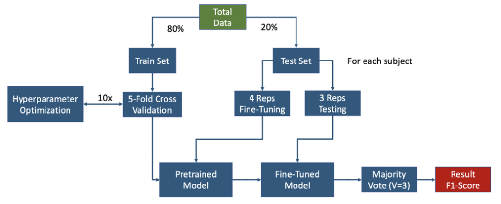

# HOLA: Hand Orthosis for Living Activities

## Background
### Purpose
Incomplete spinal cord injury (SCI) causes 
individuals to lose optimal muscle functionality below the 
level of injury, leading to a drastic reduction in 
independence when performing activities of daily living 
(ADLs). Notably, SCIs in the high cervical range, 
such as the C5 level, are the most common and present 
severe symptoms. Fortunately, those who classify at an 
American Spinal Injury Association (ASIA) C level retain 
some motor functionality below their injury site and may 
be capable of independently moving their muscles against 
gravity. Guided by an occupational therapist (OT), 
SCI patients must relearn skills for completing basic 
ADLs. Two frequently used grasps are the lateral pinch (LP) 
and transverse volar grip (TVG), which are involved in 
motions such as turning a key and gripping a cup, 
respectively, while an open hand (OH) movement is equally 
common. To design an effective hand orthosis device,
there must be a highly precise intent detection system made.

This repository holds the software components for a 
Biomedical Engineering capstone project that addresses the
above. In the `info_material` directory, a slide deck containing
the latest design and developments of the project can be found.

This GitHub repository in particular houses the machine learning model code that takes as
input electromyography (EMG) data from a user and predicts
whether they are trying to perform one of three hand gestures:
LP, TVG, or OH.

### What is EMG?

In the spinal cord there exist numerous motor neurons. These motor
neurons each innervate a variety of muscle fibers all throughout
the body. The collection of a motor neuron with its fibers it
contacts with is termed a motor unit.
Motor units are considered a small, functional unit that 
contract when they receive a signal from the brain. 
Each motor unit can fire at differing rates and create 
their own unique pattern of potential differences across 
their cell membrane. This difference in ionic and 
electric potential across the membrane of a cell is 
typically graphed as an action potential, thereby deeming a 
motor unit’s pattern as a motor unit action potential (MUAP). 
As motor units produce these action potentials in muscle 
fibres, it is the combination of a motor units action 
potential across all its muscle fibres which forms the 
MUAP. Finally, by placing an electrode near the surface of 
the skin, the MUAPs of muscle fibres can be acquired as the 
raw EMG signal. This process is summarized below.

## Requirements

Due to the design of the physical orthosis device there
were several unique requirements for the data used for
model training and inferencing. They are listed below:

- Only EMG data from 5 channels could be used
- EMG data must come from just the top and bottom halves
of the base of the forearm
- Training data must contain TVG, LP, and OH labels
- Would ideally have > 90% F1-score for all 3 labels
  - High precision because when the device actuates a movement
it should not come from a false positive (false trigger)
  - High recall because when the user makes a movement the 
device should detect that intention for higher usability

## Datasets
The above requirements were met with the combined usage of two
hand grasp datasets publicly available online.

The NinaPro DB 10 dataset had 117,414 samples for TVG and 117,627 samples for LP EMG data from 29 healthy
3 and 7 trans-radial amputee subjects, with spatial location 
of electrodes specified.

The GrabMyo dataset contained a total of 32,207 samples of OH data from 43 healthy subjects with electrode location specified.

## Preprocessing
The preprocessing involved standardizing the format of the 
two datasets, including converting monopolar electrode data
in GrabMyo to differential. The preprocessing pipeline was
standard for a notoriously noisy signal like EMG, and is 
summarized below.

## Feature Extraction
Each data repetition was windowed into windows of 152ms (38 samples) 
with a 116ms (29 samples) overlap, as it has been shown that a delay of 
less than 300ms is acceptable for real-time control of 
prostheses. Thus, the window size was chosen such that 
3 windows of data could be acquired in 224ms and likely 
processed within said benchmark. Each window was then 
further segmented into 8ms samples with 4.8ms overlap 
using a Hamming kernel. Then, short-time Fourier 
Transform (STFT) was applied to each sub-segment and 
each channel, and, by taking the power of the STFT result, 
the extracted spectrogram presented a spatiotemporal 
representation of each EMG window across 3 timesteps and 
10 frequencies. Principal component analysis (PCA) was 
then performed to reduce feature dimensions by taking 
only the top 25 principal components (PC) with highest 
explained variance. These were reshaped into a 5x5 matrix 
with the PCs spiraling outwards from the center in order of 
explained variance. Thus, each window of EMG data resulted 
in a 5x5 image with 5 channels that acted as input for the 
custom model. The process is summarized below.

## Model Architecture
The custom convolutional neural network (CNN) model 
architecture is depicted below. It was trained to 
minimize the categorical cross-entropy loss function with 
class weights that were proportional to the frequency of 
classes in the dataset, to counteract class imbalances.

## Training, Optimization, Fine-tuning
The training and optimization were performed on an NVIDIA
T4 GPU. The workflow is shown below. After pre-training,
The model was fine-tuned individually (subject-specific)
to 4 repetitions of each test subject's data and evaluated
on their remaining 3 repetitions.

## Offline Results
The model's performance on offline data was as follows:

For data collected from an actual SCI patient, the model's
offline performance was a 75.9% macro F1-score on TVG and LP
only labels.

## Deployment & Online Results
The online performance on a healthy user was 70.1% macro F1-score.

The capstone project was finished but with a lot of 
real-time deployment efforts and tuning still left for future.
Currently, the model was deployed onto a Jetson Nano microcontroller.
This microcontroller receives EMG data from an OpenBCI Cyton Board that
samples at 250 Hz.
The next step is to create a finite-state machine (FSM) that properly
connects the commands processed by the microcontroller to the linear actuators used
for moving the finger components of the device. A proposed control
flow diagram is presented below.

The decision-making requires each prediction on a window of
data to have confidence for a grasp over a threshold (ex. 70%).
Then, that prediction is entered into a 3-sample majority vote to
help smooth the erroneous predictions made by rapid incoming signals.
If there are 3 consecutive predictions made from the majority vote after a 
9-sample buffer, then the command is sent to the FSM for actuation.

Note that the above proposed flow essentially requires 9
predictions to be made (9 windows) before a command is
actuated. Thus, as the benchmark is to have real-time control
occur in < 300 ms, it would require a change in the window size used.
Or, since the current sampling board (Cyton) has a rate of 250 Hz, a
board with a higher sampling rate (ex. 2 kHz) can acquire the
38 samples + 29 samples overlapped windows in much less time, which would fit the
300 ms cut-off.
